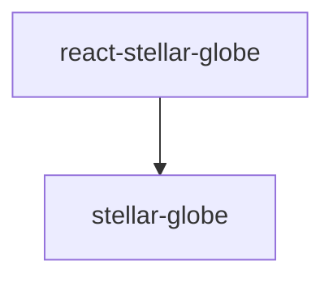

# Frontend

React + TypeScript + Vite のフロントエンドプロジェクトです。

## 技術スタック

- **React 19** - UIライブラリ
- **TypeScript** - 型安全な開発
- **Vite** - 高速なビルドツール
- **RTK Query** - データフェッチング・キャッシング
- **React Router** - ルーティング
- **Vitest** - テストフレームワーク
- **typed-scss-modules** - SCSSモジュールの型生成

## 開発コマンド

```bash
# 依存関係のインストール
npm install

# 開発サーバーの起動
npm run dev

# ビルド
npm run build

# プレビュー
npm run preview

# リント
npm run lint
```

## テスト

```bash
# テストをウォッチモードで実行
npm run test

# テストを一度だけ実行
npm run test:run

# カバレッジ付きでテスト実行
npm run test:coverage
```

## SCSS モジュールの型生成

このプロジェクトでは [typed-scss-modules](https://github.com/skovy/typed-scss-modules) を使用して、SCSSモジュールの型定義を自動生成しています。

### 設定

設定ファイル: `typed-scss-modules.config.ts`

```typescript
import type { Config } from 'typed-scss-modules'

const config: Config = {
  exportType: 'default',  // default export を使用
  nameFormat: 'camel',    // クラス名をキャメルケースに変換
  implementation: 'sass', // sass を使用
}

export default config
```

### 型ファイルの生成

```bash
# 一度だけ生成
npm run scss:types

# ファイル変更を監視して自動生成
npm run scss:watch
```

### 使用例

1. SCSSモジュールファイルを作成:

```scss
// Example.module.scss
.container {
  padding: 20px;
  
  &Title {
    font-size: 24px;
  }
}
```

2. 型生成コマンドを実行すると、`Example.module.scss.d.ts` が生成されます:

```typescript
// Example.module.scss.d.ts (自動生成)
declare const styles: {
  readonly container: string;
  readonly containerTitle: string;
};
export default styles;
```

3. コンポーネントで型安全にインポート:

```tsx
import styles from './Example.module.scss'

export function Example() {
  return (
    <div className={styles.container}>
      <h1 className={styles.containerTitle}>Title</h1>
    </div>
  )
}
```

### 注意事項

- SCSSファイルを追加・変更した場合は、`npm run scss:types` を実行して型ファイルを再生成してください
- 開発中は `npm run scss:watch` を実行しておくと、ファイル変更時に自動で型が更新されます
- 生成された `.d.ts` ファイルはコミットしてください

## ディレクトリ構造

```
src/
├── components/       # UIコンポーネント
│   └── Example/
│       ├── Example.tsx
│       ├── Example.module.scss
│       ├── Example.module.scss.d.ts  # 自動生成
│       ├── Example.test.tsx
│       └── index.ts
├── router/           # ルーティング設定
│   └── index.tsx
├── store/            # Redux store
│   ├── api/
│   │   ├── emptyApi.ts       # RTK Query ベースAPI
│   │   ├── generatedApi.ts   # 自動生成されたエンドポイント
│   │   └── apiSlice.ts       # 再エクスポート
│   ├── hooks.ts
│   ├── store.ts
│   └── index.ts
├── test/             # テスト設定
│   └── setup.ts
├── main.tsx          # エントリーポイント
└── App.tsx           # ルートコンポーネント
```

## RTK Query とOpenAPI

このプロジェクトでは [@rtk-query/codegen-openapi](https://github.com/reduxjs/redux-toolkit/tree/master/packages/rtk-query-codegen-openapi) を使用して、バックエンドのOpenAPIスキーマからRTK Queryのエンドポイントを自動生成しています。

### APIコードの生成

```bash
npm run generate-api
```

このコマンドは以下を実行します：
1. バックエンドからOpenAPIスキーマ (`openapi.json`) を取得
2. `@rtk-query/codegen-openapi` でRTK Queryのコードを生成
3. 生成されたコードは `src/store/api/generatedApi.ts` に出力

### 設定ファイル

設定ファイル: `openapi-config.cjs`

```javascript
/** @type {import('@rtk-query/codegen-openapi').ConfigFile} */
const config = {
  schemaFile: "./openapi.json",
  apiFile: "./src/store/api/emptyApi.ts",
  apiImport: "emptyApi",
  outputFile: "./src/store/api/generatedApi.ts",
  exportName: "generatedApi",
  hooks: true,
};

module.exports = config;
```

### 使用方法

生成されたフックを使用してAPIを呼び出します：

```typescript
import { useHealthzHealthzGetQuery } from '../store'

export function HealthStatus() {
  const { data, isLoading, error } = useHealthzHealthzGetQuery()

  if (isLoading) return <div>Loading...</div>
  if (error) return <div>Error</div>

  return <div>Status: {data?.status}</div>
}
```

### 注意事項

- バックエンドのAPIが変更された場合は、`npm run generate-api` を実行して再生成してください
- 生成された `generatedApi.ts` は直接編集しないでください
- カスタマイズが必要な場合は、`emptyApi.ts` の `tagTypes` や `baseQuery` を変更してください

## Stellar Globe（天球ビューワー）

このプロジェクトでは [stellar-globe](https://github.com/michitaro/stellar-globe/) を git submodule として利用しています。WebGLベースの天球ビューワーで、React コンポーネントとして使用できます。

### 依存関係

stellar-globe 内のパッケージ間には以下の依存関係があります：



したがって、ビルドは以下の順序で行う必要があります：

1. `stellar-globe`（コアライブラリ）
2. `react-stellar-globe`（React ラッパー）

### 初回セットアップ

submodule を初期化し、stellar-globe をビルドします：

```bash
# リポジトリをクローンした直後の場合、submodule を初期化
git submodule update --init --recursive

# stellar-globe パッケージをビルド
npm run build:stellar-globe
```

または、手動で各パッケージをビルドする場合：

```bash
# 1. stellar-globe（コアライブラリ）をビルド
cd ../external/stellar-globe/stellar-globe
npm install
npm run build

# 2. react-stellar-globe（React ラッパー）をビルド
cd ../react-stellar-globe
npm install
npm run build

# 3. frontend に戻る
cd ../../../frontend
npm install
```

### 使用例

```tsx
import { Globe$, GridLayer$, PanLayer$, ZoomLayer$, ConstellationLayer$ } from '@stellar-globe/react-stellar-globe'

export function SkyViewer() {
  return (
    <div style={{ width: '100%', height: '500px' }}>
      <Globe$>
        <PanLayer$ />
        <ZoomLayer$ />
        <GridLayer$ />
        <ConstellationLayer$ showNames />
      </Globe$>
    </div>
  )
}
```

### 主要コンポーネント

- **`Globe$`**: ビューワーのルートコンテナ
- **`PanLayer$`, `ZoomLayer$`, `RollLayer$`**: 操作系レイヤー
- **`GridLayer$`**: 座標グリッドレイヤー
- **`ConstellationLayer$`**: 星座レイヤー
- **`MarkerLayer$`**: マーカーレイヤー
- **`TractTileLayer$`**: タイル画像レイヤー

詳細は [react-stellar-globe README](../external/stellar-globe/react-stellar-globe/README.md) を参照してください。

### stellar-globe の更新

submodule を最新に更新する場合：

```bash
cd ../external/stellar-globe
git pull origin main
cd ../../frontend
npm run build:stellar-globe
```

