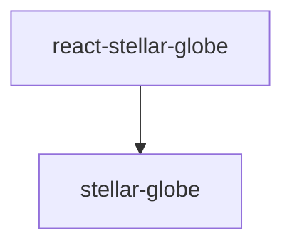

# Frontend

A frontend project built with React + TypeScript + Vite.

## Tech Stack

- **React 19** - UI library
- **TypeScript** - Type-safe development
- **Vite** - Fast build tool
- **RTK Query** - Data fetching and caching
- **React Router** - Routing
- **Vitest** - Testing framework
- **typed-scss-modules** - SCSS module type generation

## Development Commands

```bash
# Install dependencies
npm install

# Start development server
npm run dev

# Build
npm run build

# Preview
npm run preview

# Lint
npm run lint
```

## Testing

```bash
# Run tests in watch mode
npm run test

# Run tests once
npm run test:run

# Run tests with coverage
npm run test:coverage
```

## SCSS Module Type Generation

This project uses [typed-scss-modules](https://github.com/skovy/typed-scss-modules) to automatically generate type definitions for SCSS modules.

### Configuration

Configuration file: `typed-scss-modules.config.ts`

```typescript
import type { Config } from 'typed-scss-modules'

const config: Config = {
  exportType: 'default',  // Use default export
  nameFormat: 'camel',    // Convert class names to camelCase
  implementation: 'sass', // Use sass
}

export default config
```

### Generating Type Files

```bash
# Generate once
npm run scss:types

# Watch for file changes and auto-generate
npm run scss:watch
```

### Usage Example

1. Create an SCSS module file:

```scss
// Example.module.scss
.container {
  padding: 20px;
  
  &Title {
    font-size: 24px;
  }
}
```

2. Running the type generation command creates `Example.module.scss.d.ts`:

```typescript
// Example.module.scss.d.ts (auto-generated)
declare const styles: {
  readonly container: string;
  readonly containerTitle: string;
};
export default styles;
```

3. Import with type safety in your component:

```tsx
import styles from './Example.module.scss'

export function Example() {
  return (
    <div className={styles.container}>
      <h1 className={styles.containerTitle}>Title</h1>
    </div>
  )
}
```

### Notes

- When adding or modifying SCSS files, run `npm run scss:types` to regenerate type files
- During development, run `npm run scss:watch` to automatically update types on file changes
- Generated `.d.ts` files should be committed

## Directory Structure

```
src/
├── components/       # UI components
│   └── Example/
│       ├── Example.tsx
│       ├── Example.module.scss
│       ├── Example.module.scss.d.ts  # Auto-generated
│       ├── Example.test.tsx
│       └── index.ts
├── router/           # Routing configuration
│   └── index.tsx
├── store/            # Redux store
│   ├── api/
│   │   ├── emptyApi.ts       # RTK Query base API
│   │   ├── generatedApi.ts   # Auto-generated endpoints
│   │   └── apiSlice.ts       # Re-exports
│   ├── hooks.ts
│   ├── store.ts
│   └── index.ts
├── test/             # Test configuration
│   └── setup.ts
├── main.tsx          # Entry point
└── App.tsx           # Root component
```

## RTK Query and OpenAPI

This project uses [@rtk-query/codegen-openapi](https://github.com/reduxjs/redux-toolkit/tree/master/packages/rtk-query-codegen-openapi) to auto-generate RTK Query endpoints from the backend's OpenAPI schema.

### Generating API Code

```bash
npm run generate-api
```

This command performs the following:
1. Fetches the OpenAPI schema (`openapi.json`) from the backend
2. Generates RTK Query code using `@rtk-query/codegen-openapi`
3. Outputs the generated code to `src/store/api/generatedApi.ts`

### Configuration File

Configuration file: `openapi-config.cjs`

```javascript
/** @type {import('@rtk-query/codegen-openapi').ConfigFile} */
const config = {
  schemaFile: "./openapi.json",
  apiFile: "./src/store/api/emptyApi.ts",
  apiImport: "emptyApi",
  outputFile: "./src/store/api/generatedApi.ts",
  exportName: "generatedApi",
  hooks: true,
};

module.exports = config;
```

### Usage

Use the generated hooks to call APIs:

```typescript
import { useHealthzHealthzGetQuery } from '../store'

export function HealthStatus() {
  const { data, isLoading, error } = useHealthzHealthzGetQuery()

  if (isLoading) return <div>Loading...</div>
  if (error) return <div>Error</div>

  return <div>Status: {data?.status}</div>
}
```

### Notes

- Run `npm run generate-api` to regenerate when backend APIs change
- Do not directly edit the generated `generatedApi.ts`
- For customization, modify `tagTypes` or `baseQuery` in `emptyApi.ts`

## Stellar Globe (Sky Viewer)

This project uses [stellar-globe](https://github.com/michitaro/stellar-globe/) as a git submodule. It's a WebGL-based sky viewer that can be used as a React component.

### Dependencies

There are internal dependencies between stellar-globe packages:



Therefore, builds must be performed in this order:

1. `stellar-globe` (core library)
2. `react-stellar-globe` (React wrapper)

### Initial Setup

Initialize the submodule and build stellar-globe:

```bash
# If you just cloned the repository, initialize the submodule
git submodule update --init --recursive

# Build stellar-globe packages
npm run build:stellar-globe
```

Or, to manually build each package:

```bash
# 1. Build stellar-globe (core library)
cd ../external/stellar-globe/stellar-globe
npm install
npm run build

# 2. Build react-stellar-globe (React wrapper)
cd ../react-stellar-globe
npm install
npm run build

# 3. Return to frontend
cd ../../../frontend
npm install
```

### Usage Example

```tsx
import { Globe$, GridLayer$, PanLayer$, ZoomLayer$, ConstellationLayer$ } from '@stellar-globe/react-stellar-globe'

export function SkyViewer() {
  return (
    <div style={{ width: '100%', height: '500px' }}>
      <Globe$>
        <PanLayer$ />
        <ZoomLayer$ />
        <GridLayer$ />
        <ConstellationLayer$ showNames />
      </Globe$>
    </div>
  )
}
```

### Main Components

- **`Globe$`**: Viewer root container
- **`PanLayer$`, `ZoomLayer$`, `RollLayer$`**: Interaction layers
- **`GridLayer$`**: Coordinate grid layer
- **`ConstellationLayer$`**: Constellation layer
- **`MarkerLayer$`**: Marker layer
- **`TractTileLayer$`**: Tile image layer

See [react-stellar-globe README](../external/stellar-globe/react-stellar-globe/README.md) for details.

### Updating stellar-globe

To update the submodule to the latest version:

```bash
cd ../external/stellar-globe
git pull origin main
cd ../../frontend
npm run build:stellar-globe
```
